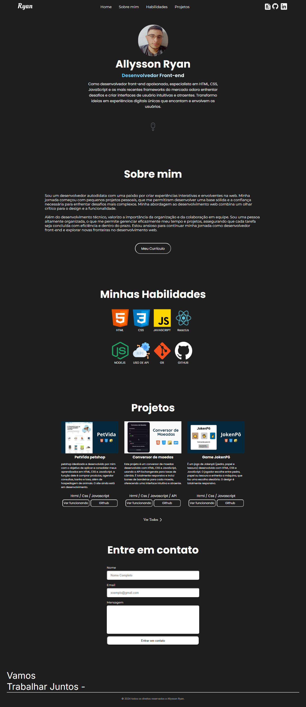

# Portifólio pessoal
Este projeto é um portfólio pessoal desenvolvido com HTML, CSS e JavaScript, utilizando a API Static Forms para gerenciar o envio de formulários de contato. É totalmente responsivo, apresentando um design moderno e acessível, com navegação intuitiva entre as seções que destacam habilidades e projetos realizados.

#### Link do site em funcionamento: <a href="#"> Clique aqui </a>

## Tecnologias
- HTML
- CSS
- JavaScript
- API Static Forms

# Screenshot
Aqui temos a captura de tela do projeto:

 